# Population demographic history visualization with R package: `popdemog`

## Introduction
Demographic history tells about when and where a particular population come from, what is the genetic relationship to each other populations, and how the population size changes along the time.
In population genetics studies, demograohic history could be either as the result of un-recorded demograohic inference from genetic data, or the assumption model to conduct simulations for possible hypothesis tests. 
Both of them need a good way to represent the history, especially when multiple populations involves.

The package *popdemog* is going to give a solution to represent population demographic history. 
It is originally designed for the simulation software ms and aims to visualize the simulation script.
Currently it can support many simulators' input, such as ms and msa [^1], msHot [^6], MaCS [^2], and Cosi [^3].
msprime's simulation script[^7] can also be supported by this package since it can be easily translated into ms-compitable commands.
More diverse inputs from simulation language will be supported in the future, please check the support list for update.

In this package, we provide three easy-to-use functions: **PlotMS**, **PlotMMig**, and **PlotMig**.
**PlotMS** is the main function to capture the demographic information from simulation script or simulation parameter file and output the tree structure of population evolution history and the arrows of migrations between lineages. 
**PlotMMig** and **PlotMig** are designed to deal with complex migration events. 
**PlotMMig** gives the overview of migrations over the time while **PlotMig** can only show migrations at one specified time point.
However, **PlotMig** has more free variables to adjust and produce finer figure for migration presentation than **PlotMMig**.
Besides, we have function **NRuler** to add population size ruler to the plot.

To better understand the examples in this tutorial, user should have a little bit experience in simulation, a little knowledge about effective population size, and the basic skill to generate figures with R. 
In this tutorial, we will use a demographic model from Cosi as an example to explore the power of *popdemog* in the population history representation. 
We also attached abundant examples to help user to handle this package.

Format rule in this tutorial: *package*, **function**, `option` & `code`.

## Simulator supporting list

 

|Simulator | Keyword | Notes|
|:----------: | :----------: | :---------------------------------------|
|Cosi | "cosi" | parameter file as the input|
|ms  | "ms"  |   |
|msa |       "msa" |  |    
|msHot  |    "mshot"  | |  
|msprime  |  "msprime" | need to convert to ms-compatile format as the input |
|MaCS     |  "macs" | |
|SCRM     |  "scrm" | |
***
 

## Install package *popdemog*

Package *popdemog* can always be installed from the source file

	install.packages("https://github.com/YingZhou001/popdemog/raw/master/popdemog_1.0.tar.gz", repos=NULL)

then load it with
	
	library(popdemog)

Now functions from this package are ready to use.

## Plot demographic history with **PlotMS**

The function **PlotMS** requires the `input.file` or `input.cmd`, and the `type` of the input to be specified. 

### Script input: `input.file`, `input.cmd`, and `type`

The `input.file` contains the all information for demographic history, it can be a copy of simulation script or the parameter file from simulation tools. 

For example, the script of ms

	./ms 1 1 -r 25 250001 -t 2.5 -I 4 50 50 50 60 -n 1 10 -n 2 10 -n 3 10 -n 4 10 -em 0 1 4 0.32 -em 0 4 1 0.32 -em 0 3 4 0.08 -em 0 4 3 0.08 -em 5e-04 2 1 2000 -em 6e-04 2 1 0 -ej 7e-04 2 4 -en 0.02 4 2.4 -en 0.035 1 0.77 -en 0.04 3 0.77 -en 0.1997 4 0.0125 -en 0.1998 3 0.00149253731343284 -en 0.1999 1 0.005 -ej 0.2 3 1 -em 0.1996 1 4 0 -em 0.1995 4 1 0 -em 0.1994 3 4 0 -em 0.1993 4 3 0 -en 0.3499 1 0.00117647058823529 -ej 0.35 1 4 -en 1.7 4 1.25


and the parameter file (from the software Cosi2) of Cosi can be the `input.file`.

	# sample file
	# comments have #s in front of them
	# newlines don't matter.
	
	#-- options that could be uncommented
	#infinite_sites yes
	#random_seed 12345   # Specifies a particular random number seed

	# in bp.
	length 250000

	# per bp per generation
	mutation_rate 1.5e-8

	recomb_file model.out
	gene_conversion_relative_rate 0.3

	# population info

	pop_define 1 european
	pop_define 3 african-american
	pop_define 4 asian
	pop_define 5 african

	#european
	pop_size 1 100000
	sample_size 1 50

	#african american
	pop_size 3 100000
	sample_size 3 50

	#asian
	pop_size 4 100000
	sample_size 4 50

	#african
	pop_size 5 100000
	sample_size 5 60

	pop_event migration_rate "afr->eur migration" 5 1 0. .000032
	pop_event migration_rate "eur->afr migration" 1 5 0 .000032
	pop_event migration_rate "afr->as migration" 5 4 0. .000008
	pop_event migration_rate "as->afr migration" 4 5 0 .000008
	pop_event admix "african american admix" 3 1 5. .2
	pop_event split "african to aa" 5 3 7.0

	pop_event change_size "agriculture - african" 5 200 24000
	pop_event change_size "agriculture - european" 1 350 7700
	pop_event change_size "agriculture - asian" 4 400 7700
	pop_event bottleneck "african bottleneck" 5 1997 .008
	pop_event bottleneck "asian bottleneck" 4 1998 .067
	pop_event bottleneck "european bottleneck" 1 1999 .02

	pop_event split "asian and european split" 1 4 2000
	pop_event migration_rate "afr->eur migration" 5 1 1996 0
	pop_event migration_rate "eur->afr migration" 1 5 1995 0
	pop_event migration_rate "afr->as migration" 5 4 1994 0
	pop_event migration_rate "as->afr migration" 4 5 1993 0

	pop_event bottleneck "OoA bottleneck" 1 3499 .085
	pop_event split "out of Africa" 5 1 3500

	pop_event change_size "african pop size" 5 17000 12500

We save  ms' script in the "sample.ms.cmd" as the example input further illustration.

For the user who want to use this package to debug their simulation script, we also provide the string input option `input.cmd`, which allows to paste the command as string input to the plot function. 
`type` is to help **PlotMS** to recognize the `input.file`.
Any dis-consistence between the `type` and the input would lead to the software crash or incorrect output model plot.
Please check the supporting list to confirm your simulator is supported and find the right keyword for your simulator. 

### Scale population size: `N4`

Effective population size is a important parameter in simulations with ms-like script (msHot, scrm, and MaCS), it is used to scale the real population size and the time for demographic events.
`N4` is remained here as the same meaning of $4N0$  in ms, which must be specified properly to give the right times for demographic events and the accurate sizes for populations.
In two cases we do not need to care about this parameter: 1) we only want to output the topology plot with `pop.scale="topology"`; 2) the simulation script do not need to re-scale the population size and time, such as Cosi.
 
### Ouput the demographic history

Now we can generate our first plot of demographic history from the ms file "sample.ms.cmd" as follow, `N4` is 10000 in this case.
	

```r
PlotMS(input.file="sample.ms.cmd", type="ms", N4=10000)
```

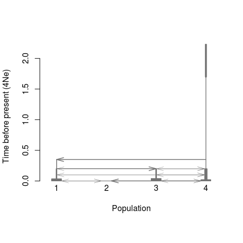

Usually, the quick plot is not satisfied. 
We have enough options to customize the output graph.

1.Adjust the lineage width. Lineage width directly reflects the population size. Here we use logarithm with base of 50 to resale the population size $N$ so as the width of lineage, following the function $log_{50}(N/N4+1)$

	pop.scale="log", log.base =50
2.Adjust the population position. A vector `inpos` is used to store the position of each population. `inpos[i]` for the `i`th population.

	inpos=c(3,6,1,9)
3.Add color to each lineage. `col.pop[i]` is stored the color for the $i$th population. The color of arrow is the same with the source population by default, or can be reset with 'col.arrow'.

	col.pop=c("blue", "coral3", "gold3", "brown")
4.Add population labels to each lineage. `pops[i]` is the name for the `i`th population.

	pops=c("European", "African American", "Asian", "African")	
add these settings to **PlotMS**, we have:

```r
PlotMS(input.file="sample.ms.cmd", type="ms", N4=10000, pop.scale="log", 
       log.base =50, inpos=c(3,6,1,9), 
       col.pop=c("blue", "coral3", "gold3", "brown"), 
       pops=c("European", "African American", "Asian", "African"))
```

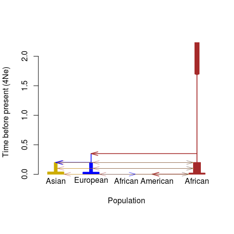

However, if the recent events should be more fantastic than ancient ones, so we can zoom in them with

	time.scale="log10year", 
which will result the y-axis as the value of $log_{10}(year)$, using default 25 years per generation. The year per generation can be defined with the parameter `gen`.

We can also only show the topology structure by
	
	pop.scale="topology"
which tells the function to ignore the time and population size but focus on the order of demographic events.	
We can also adjust the font size, axis label size, and the arrow size to fit to diverse plot region. 

	cex.lab=0.6
	cex.axis=0.6
	length.arrow=0.05
If there are too many background migrations, these events can be masked by

	m.adjust=0.05 #mask the migration with per generation rate less than 0.05
Then we have the demographic figures with:

```r
par(mfrow=c(1,2))
PlotMS(input.file="sample.ms.cmd", type="ms", N4=10000, 
       pop.scale="log", log.base =50, inpos=c(3,6,1,9), 
       col.pop=c("blue", "coral3", "gold3", "brown"), 
       pops=c("European", "African American", "Asian", "African"), 
       time.scale="log10year", cex.lab=0.6, cex.axis=0.6, length.arrow=0.05, m.adjust=0.05)
title("Zoom in recent events", cex=0.8)
NRuler("topleft", Nsize=c(1e3, 1e5), Nlab=c("1e3","1e5"), N4=10000, pop.scale="log",log.base=50, lwd=1, cex=0.6)
PlotMS(input.file="sample.ms.cmd", type="ms", N4=10000, 
       pop.scale="topology", inpos=c(3,6,1,9), 
       col.pop=c("blue", "coral3", "gold3", "brown"), 
       pops=c("European", "African American", "Asian", "African"), 
       cex.lab=0.6, cex.axis=0.6, length.arrow=0.05, ylab="Time before present", m.adjust=0.05)
title("Topology plot", cex=0.8)
```

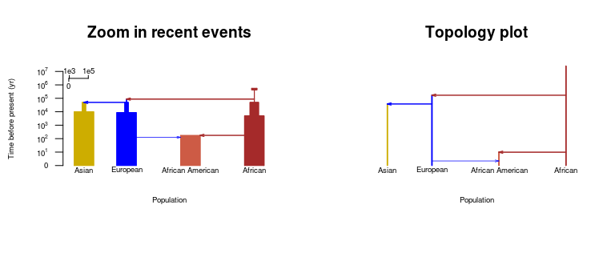

## Plot migrations

When multiple migrations exist at a particular time point, arrows in **PlotMS** might cross with the population lineages and overlap with each other. 
The migration events will be hard to read in this setting, so we use function **PlotMig** to output the migration pattern on the specified time.
We also have **PlotMMig** to output the overview of all possible migration patterns among simulated populations. 
Both of these two migration plot function are based on the output of function **PlotMS** with `plot=F`.

### Using **PlotMMig** to creat an overview of migrations

**PlotMMig** will automatically output pattern and the duration of each migration. 
Plot setting would be passed from function **PlotMS** to **PlotMMig** through the output list mig_par, more information will be found with `help(PlotMS)` in R. 

```r
#output the demograohic information from PlotMS
out<-PlotMS(input.file="sample.ms.cmd", type="ms", N4=10000, pop.scale="log", 
	    log.base =50, col.arrow="black", time.scale="kyear",
	    col.pop=c("blue", "coral3", "gold3", "brown"), 
	    pops=c("European", "African American", "Asian", "African"), 
	    plot.out=F, demo.out=T,
	    cex.lab=0.5, cex.axis=0.6, length.arrow=0.05)
#plot the overview of all migrations
PlotMMig(demograph_out=out$demograph_out, mig_par=out$mig_par)
```


### Using **PlotMig** to creat a fine migration plot

**PlotMig** is designed for the need to show migration at the specified time. 
We are going to plot all migrations at time 0.0005 (with `time_pt=0.0005`) and ignore the population size difference (with `pop.scale="topology"`).
The time point stay the same scale with the setting of `time.scale`. 
In this example, `time.scale="4Ne"` and it gives out the migration at $`0.0005\times10000\times25=125`$ years ago.

```r
out<-PlotMS(input.file="sample.ms.cmd", type="ms", N4=10000, plot.out=F, demo.out=T)
PlotMig(time_pt=0.0005, demograph_out=out$demograph_out, mig_par=out$mig_par, 
        pop.scale="log", col.pop=c("blue", "coral3", "gold3", "brown"), 
        log.base=20, ylim=c(-3, 5));
NRuler("bottomleft", Nsize=c(1e4, 1e5), Nlab=c("1e4","1e5"), N4=10000, pop.scale="log",log.base=20, lwd=1, cex=0.6)
legend("topleft", legend=c("European", "African American", "Asian", "African"), 
       pch=20, col=c("blue", "coral3", "gold3", "brown"), bty="n")
title(paste("Time: 0.0005 (",out$mig_par$time.scale, ")"))
```

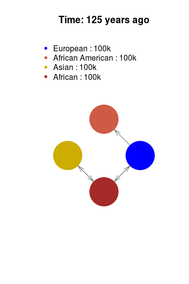

In the Figure 5, the variable `topology.scale=1.4` is used to re-scale the mono population size to 1.4 fold.
The color and size of arrows can also be adjusted by the variable `col.arrow` and the `length.arrow`, please check the arguments with `help(PlotMig)` for more information.

### Add migrations to maps   
Next, we are going to see an example of adding migration plot to a map.
In this example, we need to install the package named `maps`
	
	install.package("maps")

then load the map and save the latitude and longitude for each population in a matrix as `inp.map.pos`.
We also need to set `add=T` to let **PlotMS** add plot to other backgrounds.
We also set `m.adjust=0.01` to avoid minor migrations and set `topology.scale=10` to make each population circle large enough to be well distinguished.

```r
library(maps)
##initate the world map
map('legacy_world', fill=T, col="gray45", bg="lightgray", lty=0)
axis(1);axis(2);
##the positions for the four populations
##European 50, 20
##Asian 36, 112
##African 7, 23
##African American 38, -100
inp.map.pos<-cbind(c(20, -100, 112, 23), c(50, 38, 36, 7))

out<-PlotMS(input.file="sample.ms.cmd", type="ms", N4=10000, plot.out=F, demo.out=T)
times<-out$mig_par$time #time points for all events
times #output times points for all demographic events
```

```
##  [1] 0.0000 0.0005 0.0006 0.0007 0.0200 0.0350 0.0400 0.1993 0.1994 0.1995
## [11] 0.1996 0.1997 0.1998 0.1999 0.2000 0.3499 0.3500 1.7000
```

```r
for(i in times){
PlotMig(time_pt=i, demograph_out=out$demograph_out, mig_par=out$mig_par, 
        pop.scale="topology", col.pop=c("blue", "coral3", "gold3", "brown"), 
        topology.scale=10, add=T, map.pos=inp.map.pos, length.arrow=0.1, m.adjust=0.01, 
        col.arrow=c("blue", "coral3", "gold3", "brown"));
}
title("Migrations on the simple history")
```

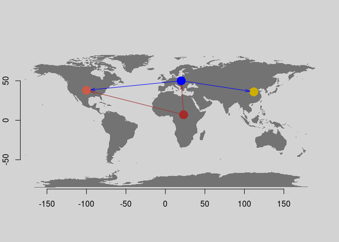

## More examples

### Modified Tennessen's model with Neanderthal introgression[^4]

```r
cat("macs 2025 15000000 -i 10 -r 3.0e-04 -t 0.00069 -T -I 4 10 1006 1008 1 0
-n 4 0.205 -n 1 58.00274 -n 2 70.041 -n 3 187.55 -eg 0.9e-10 1 482.46
-eg 1.0e-10 2 570.18 -eg 1.1e-10 3 720.23 -em 1.2e-10 1 2 0.731
-em 1.3e-10 2 1 0.731 -em 1.4e-10 3 1 0.2281 -em 1.5e-10 1 3 0.2281
-em 1.6e-10 2 3 0.9094 -em 1.7e-10 3 2 0.9094 -eg 0.007 1 0
-en 0.007001 1 1.98 -eg 0.007002 2 89.7668 -eg 0.007003 3 113.3896
-eG 0.031456 0 -en 0.031457 2 0.1412 -en 0.031458 3 0.07579
-eM 0.031459 0 -ej 0.03146 3 2 -en 0.0314601 2 0.2546
-em 0.0314602 2 1 4.386 -em 0.0314603 1 2 4.386 -eM 0.0697669 0
-ej 0.069767 2 1 -en 0.0697671 1 1.98 -en 0.2025 1 1 -ej 0.9575923 4 1
-em 0.06765 2 4 32 -em 0.06840 2 4 0", file="model-Tennessen.cmd")
#plot the demographic graph
par(mfrow=c(1,2))
PlotMS(input.file="model-Tennessen.cmd", type="macs", N4=30000, 
       pop.scale="log", log.base  =50, inpos = c(1,4,7,9), time.scale = "log10year", 
       col.pop=c("brown", "blue", "gold3", "forestgreen"), 
       pops=c("AFR", "EUR", "ASIA", "ARC"), cex.lab=1, cex.axis = 1, xlab="", length.arrow=0.1)
title("Demographic histoy")
PlotMS(input.file="model-Tennessen.cmd", type="macs", N4=30000,
       time.scale = "log10year", plot.out = F, demo.out = T)->out;
#log10(1000)=3
PlotMig(time_pt=3, demograph_out=out$demograph_out,
mig_par=out$mig_par, col.pop=c("brown", "blue", "gold3", "forestgreen"), pop.scale="topology");
legend("topleft", legend=c("AFR", "EUR", "ASIA", "ARC"), 
       col=c("brown", "blue", "gold3", "forestgreen"), pch=20, bty="n")
title("Migrations at 1000 years ago");unlink("model-Tennessen.cmd")
```

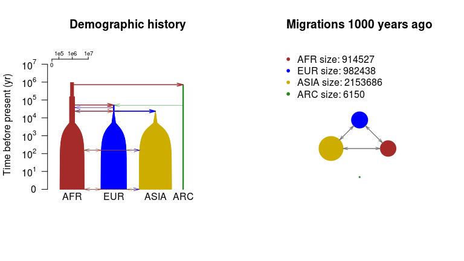

### Archaic introgrssion model [^5]

```r
cat("./ms 44 1 -r 20000 50000000 -t 30000 -I 6 20 20 1 1 1 1 -en 0 1 1
-en 0 2 1 -en 0 3 1e-10 -en 0 4 1e-10 -en 0 5 1e-10 -en 0 6 1e-10
-es 0.0125 2 0.97 -en 0.02500025 7 0.25 -en 0.02500025 2 1 -ej 0.05 4 3
-ej 0.05 6 5 -en 0.05000025 3 0.25 -en 0.05000025 5 0.25 -ej 0.0500025 5 3
-en 0.050005 3 0.25 -ej 0.075 2 1 -en 0.0750025 1 1 -ej 0.1 7 3
-en 0.1000025 3 0.25 -ej 0.3 3 1 -en 0.3000025 1 1", file="test.1.ms.cmd")
PlotMS(input.file = "test.1.ms.cmd", type="ms", N4=10000, 
time.scale = "kyear", length.arrow=0.1, inpos=c(1,2,5,4.5,5.5,6,3), 
col.pop=c("brown", "blue", "forestgreen", rainbow(10)[6:9]));unlink("test.1.ms.cmd")
```

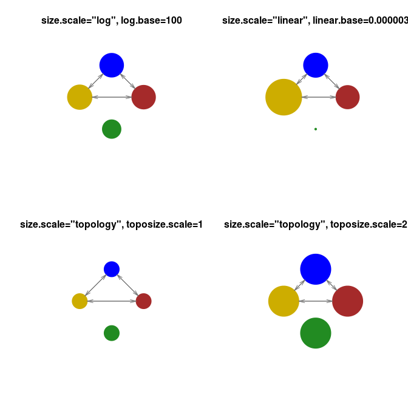

### Migration model from ms.

```r
cat("./ms 15 100 -t 3.0 -I 6 0 7 0 0 8 0 -m 1 2 2.5 -m 2 1 2.5 -m 2 3 2.5
-m 3 2 2.5 -m 4 5 2.5 -m 5 4 2.5 -m 5 6 2.5 -m 6 5 2.5 -em 2.0 3 4 2.5
-em 2.0 4 3 2.5", file="test.2.ms.cmd")
PlotMS(input.file = "test.2.ms.cmd", type="ms", N4=10000, col.pop="gray",
col.arrow="black", length.arrow=0.1, lwd.arrow=2);unlink("test.2.ms.cmd")
```

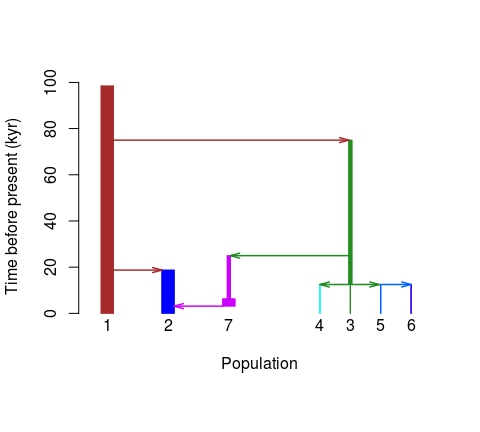

### Ryan2009's model[^9]

```r
cat("./ms 1 1 -t 1.0 -I 3 10 10 10 -n 1 1.682020 -n 2 3.736830 -n 3 7.292050
-eg 0 2 116.010723 -eg 0 3 160.246047
-ma 0 0.881098 0.561966 0.881098 0 2.797460 0.561966 2.797460 0
-ej 0.028985 3 2 -en 0.028985 2 0.287184
-ema 0.028985 3 0 7.293140 0 7.293140 0 0 0 0 0 -ej 0.197963 2 1
-en 0.303501 1 1", file="Ryan2009.cmd")
PlotMS(input.file = "Ryan2009.cmd", type="ms", N4=35000, pop.scale="log", 
log.base=2, time.scale="kyear",
pops=c("AFR", "EUR", "ESA"), col.pop=c("brown", "blue", "gold3"));unlink("Ryan2009.cmd")
```

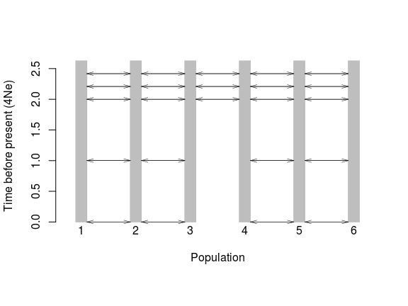

### Zigzag model   

```r
cat("ms 4 1 -t 7156.0000000 -r 2000.0000 10000000 -eN 0 5 -eG 0.000582262 1318.18
-eG 0.00232905 -329.546 -eG 0.00931619 82.3865 -eG 0.0372648 -20.5966
-eG 0.149059 5.14916 -eN 0.596236 0.5 -T", file="zigzag.cmd")
par(mfrow=c(1,2))
PlotMS(input.file = "zigzag.cmd", type="ms", N4=10000)
#change the time unit
PlotMS(input.file = "zigzag.cmd", type="ms", N4=10000, time.scale="log10year");unlink("zigzag.cmd")
```

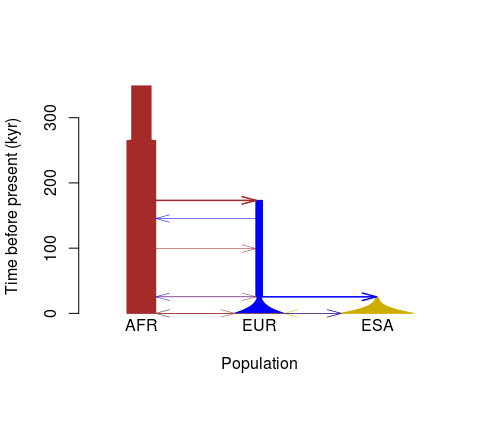

### Demographic plot from msprime's script

This package is able to extract the demographic information from msprime.
For the ms-compatible command, user only need to set the 'type' to be "msprime" and copy the command line to input file; 
for the python scripts, we will use "msprime2ms.py" to translate the simulation script of  msprime to  ms-compatible command, and then plot them out. 
Here we give an example to plot the demographic graph from msprime's script. 
Suppose msprime has been successfully installed, and the msprime's scripts of the demographic events are as follow and saved in the file "demo1.py" (copy from the msprime's online documents[^8]):

	# First we set out the maximum likelihood values of the various parameters
	N_A = 7300
	N_B = 2100
	N_AF = 12300
	N_EU0 = 1000
	N_AS0 = 510
	# Times are provided in years, so we convert into generations.
	generation_time = 25
	T_AF = 220e3 / generation_time
	T_B = 140e3 / generation_time
	T_EU_AS = 21.2e3 / generation_time
	# We need to work out the starting (diploid) population sizes based on
	# the growth rates provided for these two populations
	r_EU = 0.004
	r_AS = 0.0055
	N_EU = N_EU0 / math.exp(-r_EU * T_EU_AS)
	N_AS = N_AS0 / math.exp(-r_AS * T_EU_AS)
	# Migration rates during the various epochs.
	m_AF_B = 25e-5
	m_AF_EU = 3e-5
	m_AF_AS = 1.9e-5
	m_EU_AS = 9.6e-5
	# Population IDs correspond to their indexes in the population
	# configuration array. Therefore, we have 0=YRI, 1=CEU and 2=CHB
	# initially.
	population_configurations = [
	msprime.PopulationConfiguration(
	    sample_size=0, initial_size=N_AF),
	msprime.PopulationConfiguration(
	    sample_size=1, initial_size=N_EU, growth_rate=r_EU),
	msprime.PopulationConfiguration(
	    sample_size=1, initial_size=N_AS, growth_rate=r_AS)
	]
	migration_matrix = [
	[      0, m_AF_EU, m_AF_AS],
	[m_AF_EU,       0, m_EU_AS],
	[m_AF_AS, m_EU_AS,       0],
	]

	demographic_events = [
	# CEU and CHB merge into B with rate changes at T_EU_AS
	msprime.MassMigration(
	    time=T_EU_AS, source=2, destination=1, proportion=1.0),
	msprime.MigrationRateChange(time=T_EU_AS, rate=0),
	msprime.MigrationRateChange(
	    time=T_EU_AS, rate=m_AF_B, matrix_index=(0, 1)),
	msprime.MigrationRateChange(
	    time=T_EU_AS, rate=m_AF_B, matrix_index=(1, 0)),
	msprime.PopulationParametersChange(
	    time=T_EU_AS, initial_size=N_B, growth_rate=0, population_id=1),
	# Population B merges into YRI at T_B
	msprime.MassMigration(
	    time=T_B, source=1, destination=0, proportion=1.0),
	# Size changes to N_A at T_AF
	msprime.PopulationParametersChange(
	    time=T_AF, initial_size=N_A, population_id=0)
	]
Then we use the "msprime2ms.py" to convert the demographic description into _ms_-compatible format:

	python msprime2ms.py demo1.py population_configurations migration_matrix demographic_events
where _population_configurations_ is the name of the variable for population_configurations, _migration_matrix_ is the name of the variable for migration_matrix, and _demographic_events_ is the name of the variable for demographic_events.
Save the output to the file named "msprime.demo.cmd"

```r
cat("
--structure 3 1 1 1
--population-size 1 0.3075
--population-size 2 0.7431335886597129
--population-growth-rate-change 0 2 160.0
--population-size 3 1.352258276948663
--population-growth-rate-change 0 3 220.0
--migration-matrix x 1.2 0.76 1.2 x 3.8400000000000003 0.76 3.8400000000000003 x
--population-split 0.0212 3 2
--population-size-change 0.0212 2 0.0525
--population-growth-rate-change 0.0212 2 0
--migration-matrix-change 0.0212 3 x 10.0 x 10.0 x x x x x
--population-split 0.14 2 1
--population-size-change 0.22 1 0.1825",
file="msprime.demo.cmd")
```

Then we can use functions _PlotMS_ and _PlotMig_ to plot the demographic history.

```r
#plot the demographic graph
par(mfrow=c(1,2))
PlotMS(input.file="msprime.demo.cmd", type="msprime", N4=4*10000, 
       pop.scale="log", log.base=10, inpos = c(1,4,7), time.scale = "log10year", 
       col.pop=c("brown", "blue", "gold3"), pops=c("AFR", "EUR", "ASIA"), 
       cex.lab=1, cex.axis = 1, xlab="", length.arrow=0.1)
title("Demographic histoy")
NRuler("topleft", Nsize=c(1e3, 1e5, 1e6), Nlab=c("1e3","1e5", "1e6"), N4=40000, pop.scale="log",log.base=10, lwd=1, cex=0.6)
PlotMS(input.file="msprime.demo.cmd", type="msprime", N4=4*10000,
       time.scale = "log10year", plot.out = F, demo.out = T )->out;
#log10(100)=2
PlotMig(time_pt=2, demograph_out=out$demograph_out,
mig_par=out$mig_par, col.pop=c("brown", "blue", "gold3"), pop.scale="topology");
legend("topleft", legend=c("AFR", "EUR", "ASIA"), col=c("brown", "blue", "gold3"), pch=20, bty="n")
title("Migrations at 100 years ago");unlink("msprime.demo.cmd")
```

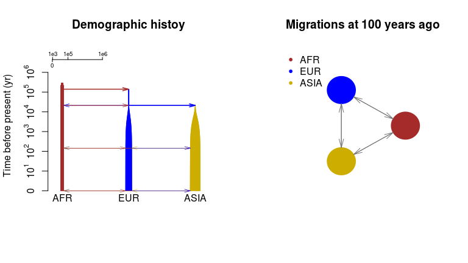

### Support for SCRM simulation script

This package can also support the scrm simulation command[^10]. 
Here we make an example simulation script that changing `-em 5e-04 2 1 2000 -em 6e-04 2 1 0` in the ms style command from the file "sample.ms.cmd" to `-eps 5e-04 2 1 0.8`.  


```r
cat("scrm 1 1 -r 25 250001 -t 2.5 -I 4 50 50 50 60 -n 1 10 -n 2 10
    -n 3 10 -n 4 10 -em 0 1 4 0.32 -em 0 4 1 0.32 -em 0 3 4 0.08 
    -em 0 4 3 0.08 -eps 5e-04 2 1 0.8 -ej 7e-04 2 4 
    -en 0.02 4 2.4 -en 0.035 1 0.77 -en 0.04 3 0.77 -en 0.1997 4 0.0125 
    -en 0.1998 3 0.00149253731343284 -en 0.1999 1 0.005 -ej 0.2 3 1 
    -em 0.1996 1 4 0 -em 0.1995 4 1 0 -em 0.1994 3 4 0 -em 0.1993 4 3 0 
    -en 0.3499 1 0.00117647058823529 -ej 0.35 1 4 -en 1.7 4 1.25", file="scrm.demo.cmd")
par(mfrow=c(1,2))
PlotMS(input.file="scrm.demo.cmd", type="scrm", N4=10000,
       pop.scale="log", log.base =50, inpos=c(3,6,1,9),
       col.pop=c("blue", "coral3", "gold3", "brown"),
       pops=c("European", "African American", "Asian", "African"),
       time.scale="log10year", cex.lab=0.6, cex.axis=0.6, length.arrow=0.05, m.adjust=0.05)
title("Zoom in recent events", cex=0.8)
PlotMS(input.file="scrm.demo.cmd", type="scrm", N4=10000,
       pop.scale="topology", inpos=c(3,6,1,9),
       col.pop=c("blue", "coral3", "gold3", "brown"),
       pops=c("European", "African American", "Asian", "African"),
       cex.lab=0.6, cex.axis=0.6, length.arrow=0.05, ylab="Time before present", m.adjust=0.05)
title("Topology plot", cex=0.8);unlink("scrm.demo.cmd")
```

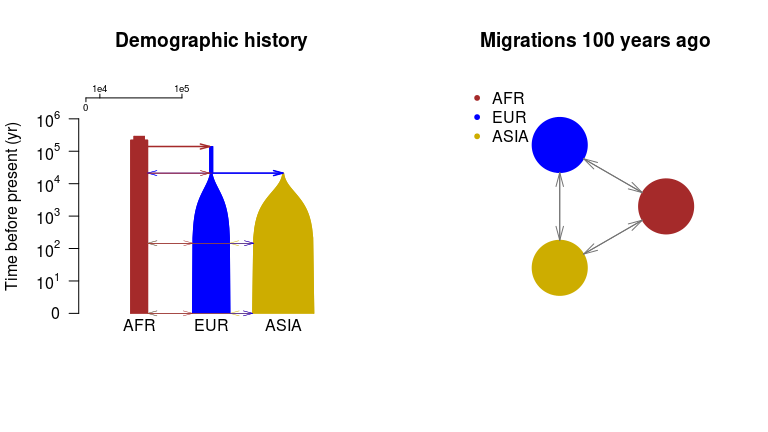

## Acknowlegements   
Xiaowen Tian wrote the python script "msprime2ms.py".

## References
[^1]: Hudson, R. R. "Generating Samples under a Wright-Fisher Neutral Model of Genetic Variation." Bioinformatics 18.2 (2002): 337-38.   
[^2]: Chen, G. K., P. Marjoram, and J. D. Wall. "Fast and Flexible Simulation of DNA Sequence Data." Genome Research 19.1 (2008): 136-42.   
[^3]: Shlyakhter, Ilya, Pardis C. Sabeti, and Stephen F. Schaffner. "Cosi2: An Efficient Simulator of Exact and Approximate Coalescent with Selection | Bioinformatics | Oxford Academic." OUP Academic. Oxford University Press, 22 Aug. 2014.   
[^4]: Vernot, B., S. Tucci, J. Kelso, J. G. Schraiber, A. B. Wolf, R. M. Gittelman, M. Dannemann, S. Grote, R. C. Mccoy, H. Norton, L. B. Scheinfeldt, D. A. Merriwether, G. Koki, J. S. Friedlaender, J. Wakefield, S. Paabo, and J. M. Akey. "Excavating Neandertal and Denisovan DNA from the Genomes of Melanesian Individuals." Science 352.6282 (2016): 235-39.   
[^5]: Moorjani, Priya, et al. “A Genetic Method for Dating Ancient Genomes Provides a Direct Estimate of Human Generation Interval in the Last 45,000 Years.” Proceedings of the National Academy of Sciences, vol. 113, no. 20, Feb. 2016, pp. 5652–5657., doi:10.1073/pnas.1514696113.   
[^6]: Hellenthal, G., and M. Stephens. "MsHOT: Modifying Hudson's Ms Simulator to Incorporate Crossover and Gene Conversion Hotspots." Bioinformatics 23.4 (2006): 520-21.   
[^7]: Jerome Kelleher, Alison M Etheridge and Gilean McVean (2016), Efficient Coalescent Simulation and Genealogical Analysis for Large Sample Sizes, PLoS Comput Biol 12(5): e1004842. doi: 10.1371/journal.pcbi.1004842   
[^8]: https://msprime.readthedocs.io/en/latest/tutorial.html#demography   
[^9]: Gutenkunst RN, Hernandez RD, Williamson SH, Bustamante CD (2009) Inferring the Joint Demographic History of Multiple Populations from Multidimensional SNP Frequency Data. PLOS Genetics 5(10): e1000695. https://doi.org/10.1371/journal.pgen.1000695   
[^10]: Paul R. Staab, Sha Zhu, Dirk Metzler and Gerton Lunter. scrm: efficiently simulating long sequences using the approximated coalescent with recombination. Bioinformatics (2015) 31 (10): 1680-1682. doi:10.1093/bioinformatics/btu861.   
